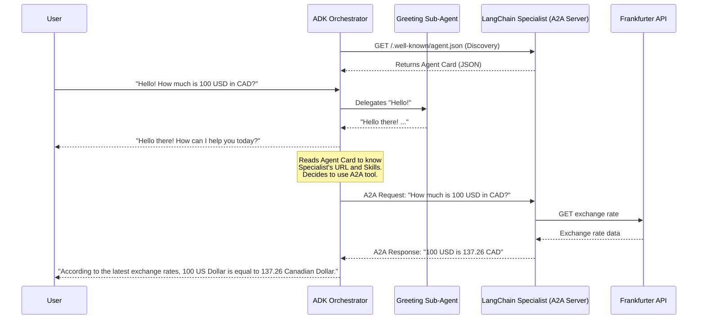

# Cooperative Multi-Agent System: ADK, LangChain & A2A Protocol


This project demonstrates a multi-agent system where two AI agents, built with different modern frameworks, cooperate to solve user queries. Communication between the agents is handled using the standardized **A2A (Agent-to-Agent) Protocol**.

The system consists of:
1.  An **Orchestrator Agent** built with **Google's Agent Development Kit (ADK)**.
2.  A **Specialist Agent** built with **LangChain** and **LangGraph**.

This repository serves as a practical, working example of agent interoperability.

---

## 🏗️ Architecture

The system is designed with a client-server architecture where the ADK agent acts as the orchestrator and the LangChain agent acts as a specialized, callable tool. The ADK agent discovers the LangChain agent by fetching its public **Agent Card**.



---

## 🔍 Agent Discovery: The Agent Card (`agent.json`)

[cite_start]The A2A protocol enables one agent to **discover and search for the functionalities** of another agent through a public JSON manifest called an **Agent Card**[cite: 7040, 4762]. [cite_start]This file acts as a "digital business card" for the agent[cite: 1656, 4834, 5167].

[cite_start]When the ADK Orchestrator's client tool wants to connect to the LangChain Specialist, it first fetches the Agent Card from the standard URL: `http://localhost:10000/.well-known/agent.json`[cite: 1657, 4834, 7040].

From this file, the orchestrator learns everything it needs to know:
-   [cite_start]**`name`** and **`description`**: What the agent is and what it does[cite: 1662, 5904].
-   [cite_start]**`url`**: The specific endpoint where it should send A2A requests[cite: 1664, 5904].
-   [cite_start]**`capabilities`**: Whether advanced features like `"streaming":true` are supported[cite: 1666, 5904].
-   **`skills`**: A detailed list of the agent's functionalities. [cite_start]The orchestrator's LLM can read this to understand that the specialist has a tool with the id `"convert_currency"` for handling exchange rates[cite: 1615, 5904].

### Example `agent.json` for the LangChain Specialist Agent:

```json
{
  "capabilities": {
    "pushNotifications": false,
    "streaming": true
  },
  "defaultInputModes": [
    "text/plain"
  ],
  "defaultOutputModes": [
    "text/plain"
  ],
  "description": "Helps with real-time exchange rates for currencies.",
  "name": "Currency Specialist Agent (LangChain)",
  "preferredTransport": "JSONRPC",
  "protocolVersion": "0.3.0",
  "skills": [
    {
      "description": "Helps with exchange values between various currencies.",
      "examples": [
        "What is the exchange rate between USD and GBP?"
      ],
      "id": "convert_currency",
      "name": "Currency Exchange Rates Tool",
      "tags": [
        "currency conversion",
        "currency exchange"
      ]
    }
  ],
  "url": "http://localhost:10000/",
  "version": "1.0.0"
}
```

---

## 📂 File Structure

The repository is organized into four key files:

-   `langchain_server_main.py`: The entry point for the LangChain specialist agent. It starts the Uvicorn server and exposes the agent via the A2A protocol.
-   `currency_agent_langchain.py`: Contains the core logic for the currency agent, including the LangChain/LangGraph setup and the tool for fetching exchange rates.
-   `adk_orchestrator_main.py`: The entry point for the ADK orchestrator agent. It defines the agent team and runs the example conversation.
-   `a2a_client_tool.py`: A crucial file that defines the ADK `Tool`. This tool acts as an A2A client, enabling the ADK agent to communicate with the LangChain agent.

---

## 🚀 Getting Started

Follow these steps to get the project running.

### Requirements
* Python 3.12+
* A **Google API Key** for the Gemini model. You can get a key from [Google AI Studio](https://aistudio.google.com/app/apikey).

### Setup and Installation

**1. Clone the Repository**
```bash
git clone [https://github.com/agulli/distributed_agents_langchain_adk_talking_a2a.git](https://github.com/agulli/distributed_agents_langchain_adk_talking_a2a.git)
cd distributed_agents_langchain_adk_talking_a2a
```

**2. Install Dependencies**
Install all the required Python libraries using `pip`.
```bash
pip install google-adk langchain-google-genai langgraph httpx uvicorn click python-dotenv git+[https://github.com/google/a2a-python.git](https://github.com/google/a2a-python.git)
```

**3. Configure Your API Key**
Create a file named `.env` in the root of the project directory and add your Google API key.

```
# .env
GOOGLE_API_KEY="YOUR_GOOGLE_API_KEY_HERE"
```

---

## ⚡ Running the System

You will need to run the two agents in **separate terminal windows**.

### Terminal 1: Start the LangChain Specialist Agent (Server)
This command starts the A2A server. It will wait for requests on port 10000.

```bash
python langchain_server_main.py
```

### Terminal 2: Run the ADK Orchestrator Agent (Client)
This command starts the ADK agent, which will kick off the example conversation.

```bash
python adk_orchestrator_main.py
```

---

## 📋 Example Usage

If everything is set up correctly, you will see the following interaction.

**Terminal 1 (LangChain Server) Output:**
The server starts and waits. When the ADK agent calls it, new logs will appear.
```
🚀 Starting LangChain A2A Specialist Agent at http://localhost:10000
📄 Agent Card available at http://localhost:10000/.well-known/agent.json
INFO:     Started server process [53315]
INFO:     Waiting for application startup.
INFO:     Application startup complete.
INFO:     Uvicorn running on http://localhost:10000 (Press CTRL+C to quit)

# --- This appears when the ADK agent makes its call ---
INFO:     ::1:xxxxx - "POST / HTTP/1.1" 200 OK
```

**Terminal 2 (ADK Orchestrator) Output:**
The orchestrator runs the conversation, delegating tasks to its internal sub-agent (for "Hello") and the external A2A agent (for the currency query).
```
🤖 ADK Orchestrator is ready. Interacting...


>>> User Query: Hello
<<< Agent Response: Hello there! How can I help you today?


>>> User Query: How much is 100 USD in CAD?
--- Tool: Invoking A2A Specialist with query: How much is 100 USD in CAD? ---
<<< Agent Response: According to the latest exchange rates, 100 US Dollar is equal to 137.26 Canadian Dollar.


>>> User Query: What's the weather like?
<<< Agent Response: I can only handle currency questions and greetings.
```

---

## 🔧 Troubleshooting

* **API Key Error**: If you see a `ValueError: Missing key inputs argument!`, make sure your `.env` file is in the correct directory and is named correctly.
* **Connection Error**: If the ADK agent reports an error connecting to the specialist, ensure the `langchain_server_main.py` script is running in the other terminal and is not blocked by a firewall.
* **Incorrect Agent Response**: The behavior of LLMs can sometimes be non-deterministic. If the ADK agent doesn't delegate correctly or fails to use the tool's output, try making the `instruction` prompt in `adk_orchestrator_main.py` more specific.